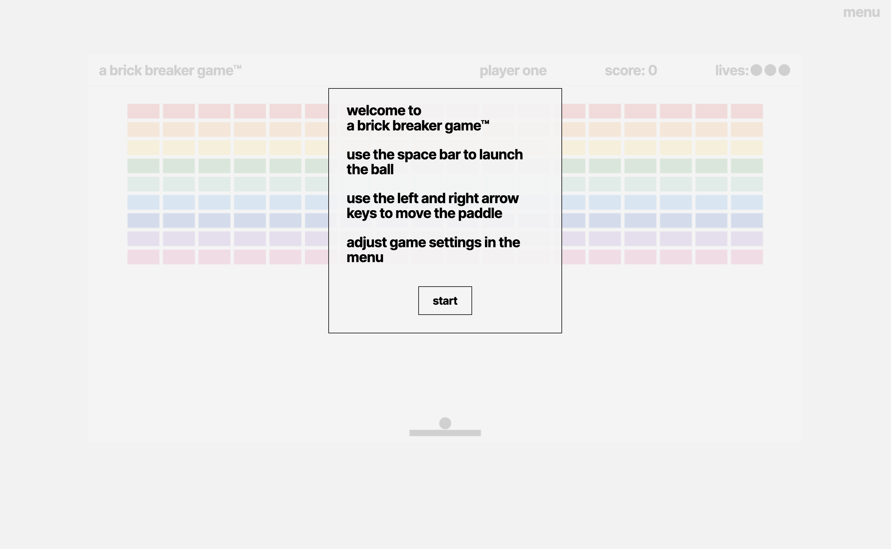
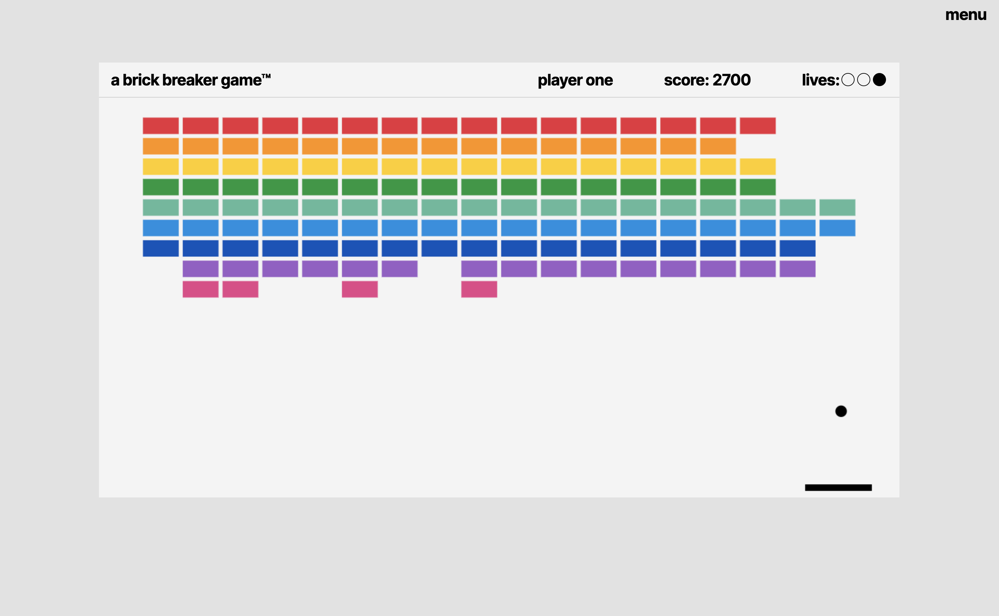
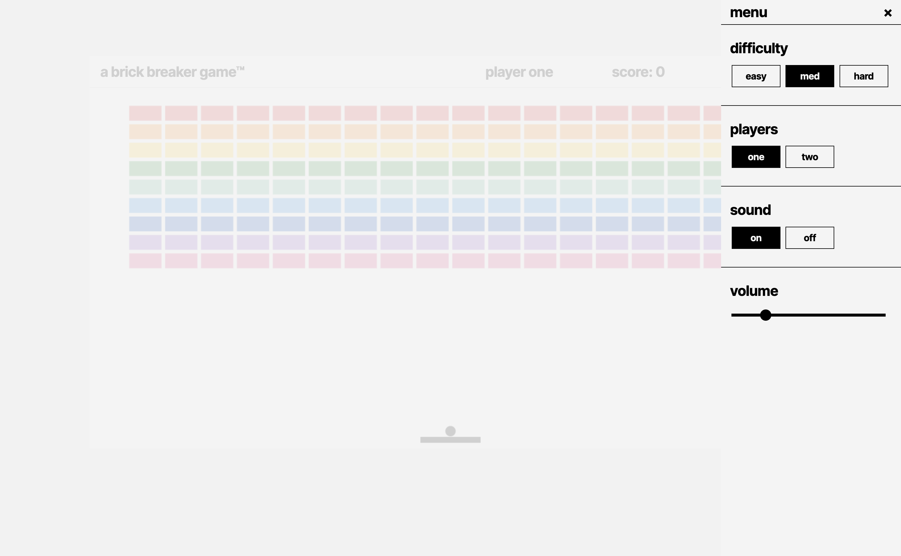
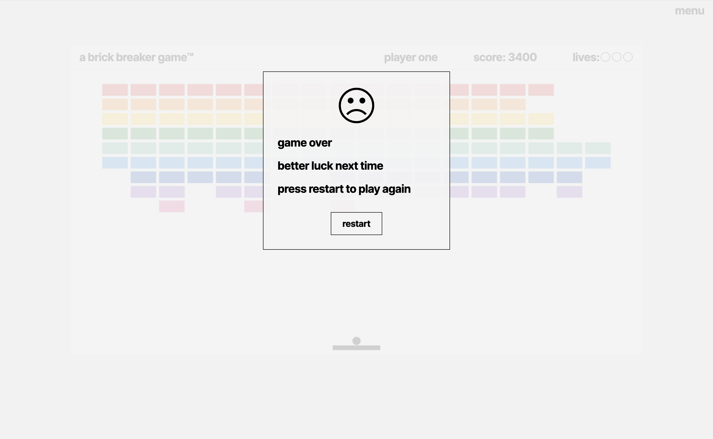

# a brick breaker game™

**a brick breaker game™** is my take on Atari's classic arcade game, Breakout. 
The goal of the game is to destroy all the bricks on the screen by using the paddle to bounce the ball toward them, without letting the ball fall below the paddle.

### Pseudocode and Wireframe

Initial pseudocode and wireframe plan:

**Project 1:** The DOM Game

**Game:** A Brick Breaker Game

**Wireframe:** 
[Click here](https://www.figma.com/file/wU03s8ztf5Sp8DJRPqV9Ql/Project-1---Wireframe?type=design&node-id=0%3A1&t=uWgMZbwQknvcqzWX-1) to view the initial wireframe on Figma.

**Pseudocode:** 

'''
state variables: 
    set score to 0
    set lives to 3
    bricks
    ball position
    paddle position

cached elements: 
    cache score from html
    cache lives from html
    cache paddle element from html
    cache ball element from html
    cache brick elements from html
    cache game container from html

event listeners: 
    spacebar --> launch ball
    left arrow --> move paddle to the left
    right arrow --> move paddle to the right

functions: 
    initialize
        initialize dom elements in browser

    collision detection
        if ball collides with paddle or side or top wall 
            bounce ball in opposite direction at same angle 
            render state to dom
        else if ball collides with brick, 
            bounce ball in opposite direction at same angle
            remove brick
            increment score
            render state to dom

    missed ball
        if ball falls past paddle, 
            decrement lives
            reset ball on paddle
            render state to dom

things to figure out: 
    use html canvas api or divs
    ball movement
    collision detection
    different brick colors require different number of hits to remove
    include powerups
    1 or 2 players
    difficulty options
'''

## Screenshots:
#### Game Start

#### Gameplay

#### Game Options Menu

#### Result Modal

## Technologies Used:
JavaScript, HTML, CSS

## Getting Started:
[Click here](https://hlysllrs.github.io/unit-1-project/) to play the game.

Use the spacebar to launch the ball, and use the arrow keys to move the paddle.
You will have 4 chances to clear all of the bricks. 
Difficulty, number of players, and sound settings can be adjusted in the menu. 

## Next Steps: 
- implement the player's score in a more meaningful way, to it isn't always the same

- improve collisions to recognize the sides of bricks and the paddle

- improve ball movement direction and allow for more precise control of the ball's direction

- allow paddle to be moved before ball is launched

- prevent ball acceleration when spacebar is pressed after ball is launched

- add transitions between players' turns in 2-player mode

- add ability for game to be paused

- add different brick layouts

- add in power-ups and bonuses that drop from random bricks when hit:
    - extend paddle width
    - magnetic paddle 
    - multiple balls
    - ability to shoot at the bricks
    - bonus lives
    - bonus points

- add in different types of bricks 
    - bricks that require multiple hits to remove
    - barrier bricks that can not be removed

- improve sound effects to play for each brick hit

- improve responsive layout
    - improve resizing text when window size changes
    - change game orientation for smaller screens